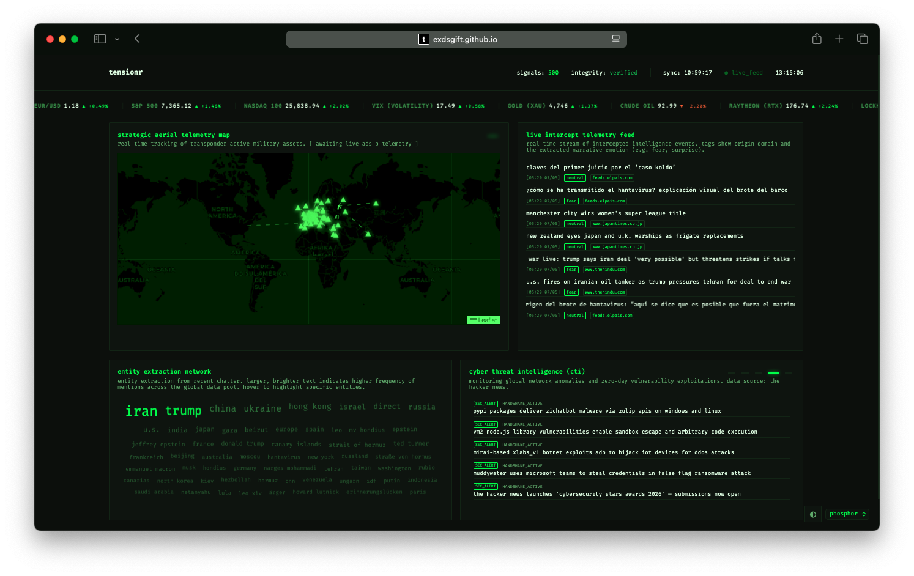

# ⚡️ tensionr
> **Real-time Global Intelligence & Narrative Resonance Engine.**

[](https://opensource.org/licenses/MIT)
[](#)
[](#)

**tensionr** is a high-fidelity intelligence dashboard designed to monitor global instability, narrative shifts, and strategic asset movements in real-time. By synthesizing multi-domain signals (from GDELT news flows to ADS-B aerial telemetry) tensionr provides a unified "Geopolitical Tactical Picture" for rapid situational awareness.



## 🛰️ Core Capabilities

- **LLM-Powered SITREP & Insight:** Tactical bulletins summarized via **DistilBART**, plus a cross-domain "Strategic Insight" correlation synthesized via **Mistral-7B-Instruct**.
- **Geopolitical Time Machine:** A "Static Data Lake" of daily archives, allowing users to select past dates and visualize historical geopolitical shifts.
- **Narrative Resonance Mapping:** Uses NLP (GoEmotions) to extract granular emotional undertones (Fear, Anger, Sadness, etc.) from global news nodes.
- **Strategic Aerial Telemetry:** Real-time tracking of military assets with automated anomaly detection for strategic airframes.
- **Multi-Domain GTI:** A composite algorithmic score quantifying global instability based on news sentiment, market volatility (VIX, Gold), and tactical telemetry.
- **Resilient Data Pipeline:** Parallelized RSS fetching and smart API fallbacks ensuring continuous intelligence even under rate-limiting.

## 🎯 Who is it for?

- **OSINT Analysts:** Rapidly aggregate and filter unverified raw chatter and verified news nodes.
- **Risk Managers:** Monitor the GTI to assess corporate or asset exposure in volatile regions.
- **Geopolitical Researchers:** Visualize how narratives evolve and spread across different domains and languages.
- **Data Enthusiasts:** A showcase of real-time data orchestration using Python, JS, and automated CI/CD pipelines.

## 🛠️ Tech Stack

- **Backend:** Python (Data harvesting, GDELT integration, NLP sentiment analysis).
- **Frontend:** Vanilla JS / Bootstrap 5 / Leaflet.js (Tactical mapping and hardware-accelerated UI).
- **Orchestration:** GitHub Actions (automated telemetry sync every hour).
- **Environments:** Managed via `uv` with a committed `uv.lock` for reproducible builds.

## 🚀 Quick Start

1. **Clone the repository:**
   ```bash
   git clone https://github.com/exdsgift/tensionr.git
   cd tensionr
   ```

2. **Setup environment:**
   ```bash
   uv sync
   ```

3. **Launch the Engine:**
   Run the data pipeline to populate the dashboard (set `HF_TOKEN` in `.env` to enable the ML stages):
   ```bash
   uv run tensionr
   ```
   Then serve the dashboard locally (the app fetches `data/*.json`, so it needs an HTTP server, not `file://`):
   ```bash
   python -m http.server 8123
   ```
   and open <http://localhost:8123>.

4. **Run the tests:**
   ```bash
   uv run pytest
   ```

---

*tensionr © 2026 // Engineered for the next generation of global observers.*
